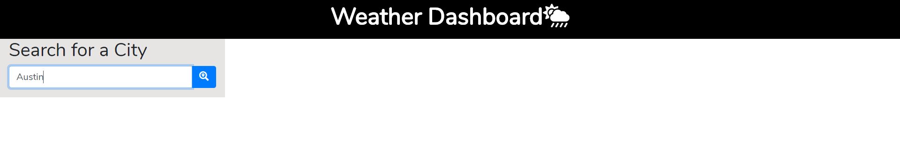
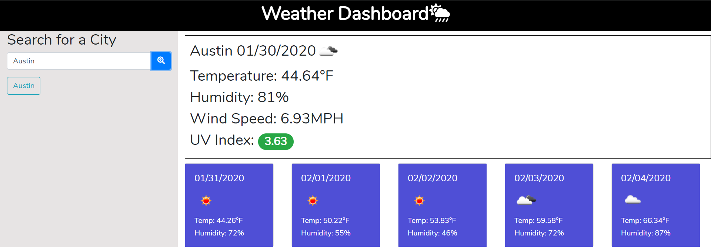
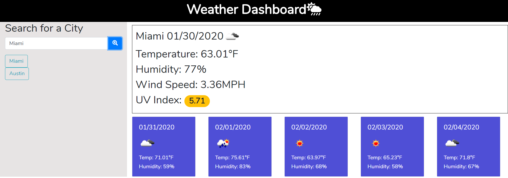
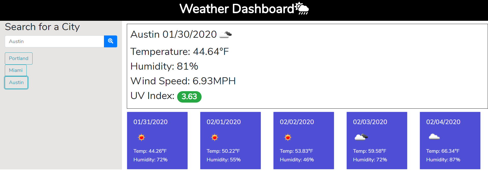

# weather_dashboard

Please use this weather dashboard to plan all of your picnics, kite flying and sunscreen wearing! This dashboard gives you specific information about the current day and a 5 day forecast so you can plan your week. 

This application is made with HTML, CSS, and Javascript.

## Libraries
 * Bootstrap
 * Font Awesome
 * Moment JS
 * jQuery

## APIs
 * https://openweathermap.org/current
 * https://openweathermap.org/forecast5
 * https://openweathermap.org/api/uvi

## Instructions
1. Enter a city name into the search bar. There is no need to add a state.

2. Check out your neat 5 day forecast.

3. Get curious about another city 

4. You can click on a city button to search for that city again.

## Authors

* **Emily Taylor** - *Initial work* - [emilyporterfieldtaylor](https://github.com/emilyporterfieldtaylor)

## APIs Used

## License

This project is licensed under the MIT License 

## Acknowledgments

* Tyler Wood - my helpful roommate

